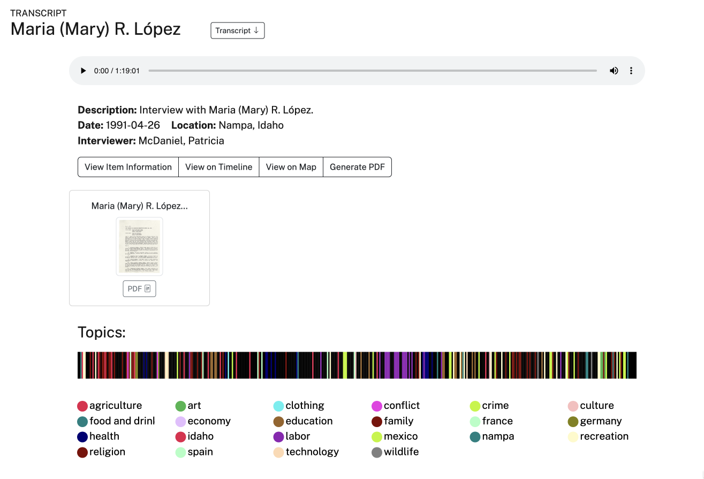

# transcript_mining_base

 

This tool text-mines oral history transcriptions to create tags for the University of Idaho's **Oral History as Data** template. While item-level metadata, such as descriptions, interview dates, and interviewer and interviewee names, describe the recording as a whole, dialogue-level tagging identifies **places, subjects, and people as they are mentioned throughout the transcript**.

 

<figure>
  
</figure>

 

In the example above, item-level metadata appears alongside dialogue-level tags. These tags generate both the buttons associated with specific subjects and the chronological markers displayed on the audio timeline. Detailed tagging structures allow researchers to visualize relationships and networks across large bodies of transcribed material in ways that linear listening and keyword searching alone cannot.

 

## Development

The tool was originally designed as a collaborative workflow in which student workers could modify tag sections and terms using Google Sheets and Apps Script. That workflow is described in [*Distant Listening: Using Python and Apps Scripts to Text Mine and Tag Oral History Collections*](https://journal.code4lib.org/articles/18286), published in *Code4Lib Journal* in April 2025.

The tool was subsequently refined through work with the [Context Podcast Collection](https://www.lib.uidaho.edu/digital/context/), [Hispanic Oral History Project Collection](https://www.lib.uidaho.edu/digital/hohp/), and the 550+ hour [Latah County Oral History Collection](https://www.lib.uidaho.edu/digital/lcoh/). It is now designed to operate independently, without additional proprietary tools.

 

## How It Works

The script uses **63 distinct text-mining dictionaries containing approximately 3,500 terms**. It:

- Surveys transcripts placed in the `A` folder.
- Produces tagged versions in the `B` folder.
  - Adds both a **parent tag** column and a **specific term** column identifying the terms detected on each dialogue row.
- Generates CSV reports in the `C` folder summarizing active tag sections and providing file-by-file tag and term counts.

The resulting reports can also help identify patterns in the collection and reassess interview-level subject tagging.

 

## Customization

Tag sections can be turned on or off to accommodate categories that are particularly relevant to the semantics or subject matter of an individual oral history collection. This allows the same core workflow to be adapted without requiring changes to the underlying script.

 

Overall, the tool provides a consistent and flexible method to enrich oral history transcripts with detailed, dialogue-level metadata and understand a collection's underlying themes and connections from a holistic perspective.

 

 _Andrew Weymouth, Spring 2024 -- Updated Fall 2026_.
